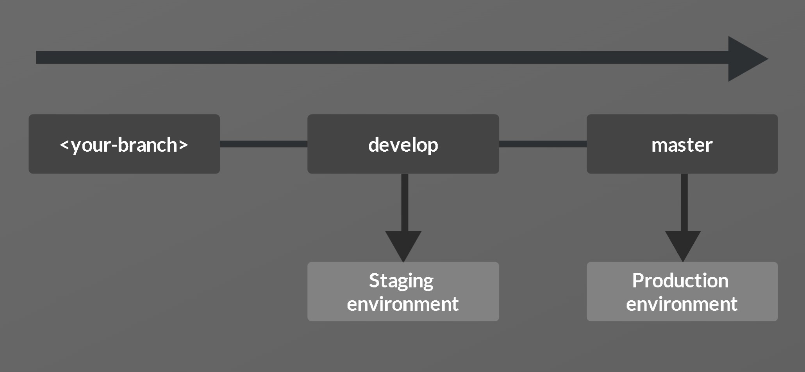
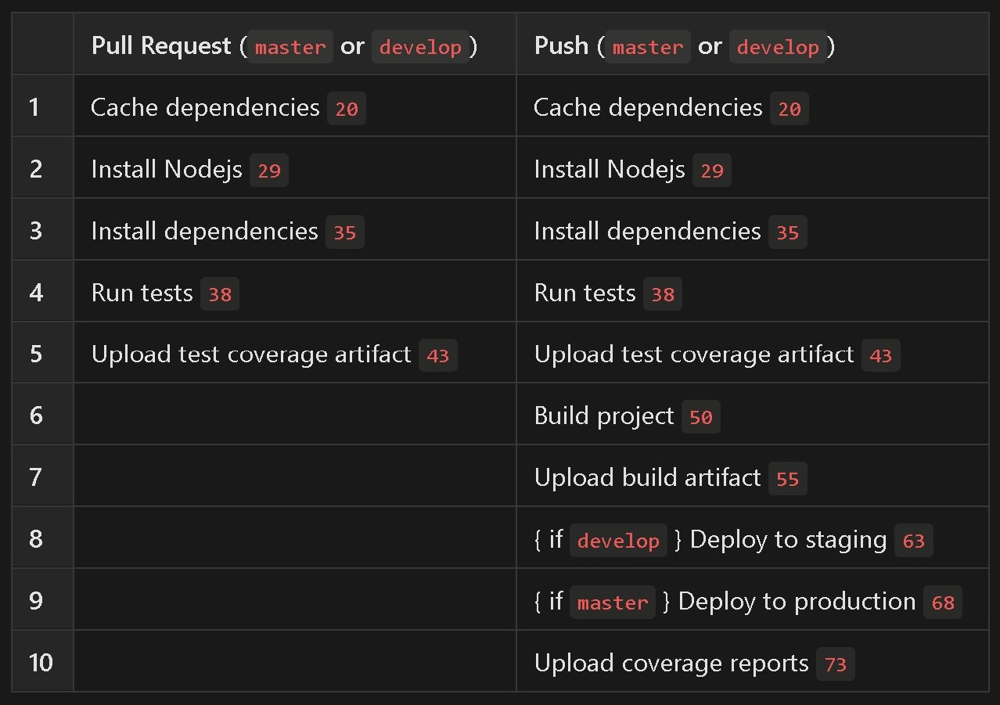

# React project template

This template bootstraps a React project with CI/CD workflows through GitHub Actions.

Benefits:

- Keep a clean and organized development process.
- Automatate testing and deployment of code to staging and production environments.
- Automatically upload artifacts and coverage reports.

## To use

### 1. Set up repository

- Create a new repo on GitHub
- Clone this repository to your machine - `git clone https://github.com/cwaymeyer/react_deployment_template.git`
- Set origin to your repo - `git remote set-url origin <your-repo-url>` (`git remote --v` to verify)

### 2. Set branch structure

Your branch used for production/deployment is the default branch, <b>master</b>. For CI/CD to work correctly, you must create a branch off of master, <b>develop</b>. This will be your staging branch.

All features and updates should be made through a unique branch, and PR's made to <b>develop</b>.

The above process is <b>necessary</b> for the workflow to work as intented. Beyond develop and master, you can use any branch name you like.

### 3. Set up Surge

- Install surge (`npm install -g surge`)
- Run `surge` to create a domain. <i>You will want to do this twice and set two different domains - one for staging and one for production</i>. Must have a Surge account.

[Reference video](https://www.youtube.com/watch?v=-EjdMvYPSVU&t=55s).

### 4. Link repository to Codecov

For code coverage reporting, you must register your repository with Codecov. Instructions found [here](https://docs.codecov.com/docs).

### 5. Customize workflow

The workflow for this project can be found at [`.github/workflows`](https://github.com/cwaymeyer/react_deployment_template/blob/master/.github/workflows/ci.yml).

> <b>Properties to update:</b>
>
> - `STAGING_URL (line 14)`
> - `PRODUCTION_URL (line 15)`

Update lines 14-15 with the staging and production URLs you set in step 3.

<b>This workflow will run on a PR or push to the develop or master branch</b>. Below is an overview of how the workflow operates with each event:

For more information on GitHub Actions, see [the docs](https://docs.github.com/en/actions).

### 6. Set GitHub Secrets

In your GitHub repository, navigate to <b>Settings</b> ➡ <b>Secrets</b> ➡ <b>Actions</b>. Create two secrets with the following keys and values:

> - `SURGE_LOGIN` - your Surge ID
> - `SURGE_TOKEN` - your Surge password

### You are now ready to begin adding your own code and deploying!
